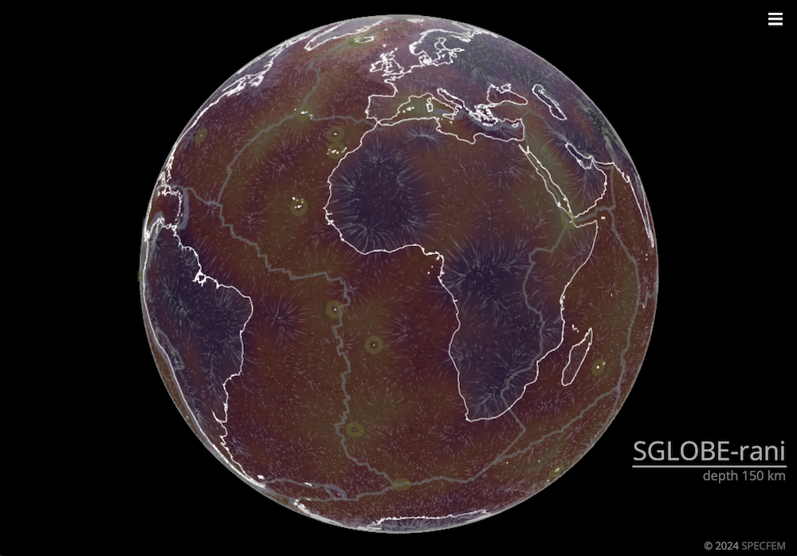

# magma earth

This is an experimental project of an interactive 3D web viewer for seismic tomographic models.
The website displays seismic images at a depth of 150 km from different global tomographic models. The flow animation follows the seismic velocity gradient to provide an intuitive visual of the model.

Currently supported models:

| Model |   |
|-------|---|
| SGLOBE-rani* | [Chang et al. (2015) doi:10.1002/2014JB011824](https://agupubs.onlinelibrary.wiley.com/doi/full/10.1002/2014JB011824)|
| S40RTS*      | [Ritsema et al. (2011) doi:10.1111/j.1365-246X.2010.04884.x](https://onlinelibrary.wiley.com/doi/abs/10.1111/j.1365-246X.2010.04884.x) |
| SAVANI        | [Auer et al. (2014) doi:10.1002/2013JB010773](https://agupubs.onlinelibrary.wiley.com/doi/abs/10.1002/2013JB010773) |
| SPani-S       | [Tesoniero et al. (2015) doi:10.1002/2015JB012026](https://agupubs.onlinelibrary.wiley.com/doi/10.1002/2015JB012026/abstract;jsessionid=807CA5C22CFE0879DE2CB66CCA80A7C0.f04t03)|
| TX2015        | [Lu and Grand (2016) doi:10.1093/gji/ggw072](https://academic.oup.com/gji/article/205/2/1074/691474?login=false)|
_____________

* denotes models implemented in [SPECFEM3D_GLOBE](https://github.com/SPECFEM/specfem3d_globe)

## Flow animation for tomographic seismic images

This project is still in a beta version with limited features and capabilities.
The site reads in seismic models, that is tomographic depth slices of shear velocities, as grayscale JPEG-images.
The images have been created so far using the excellent [SubMachine web tool](https://users.earth.ox.ac.uk/~smachine/cgi/index.php?page=tomo_depth)
from Kasra Hosseini.

Once a tomographic depth slice is read in, this project will compute its seismic velocity gradients.
This gradient represents the vector field for the particle animation. Assuming fast velocities (bright gray colors in the original JPEG-image) correspond
to cold mantle material and slow velocities (dark gray) to hot material, the gradient might be similar to a temperature gradient.
Thus, you can think of the particles as being mantle material moving from hot to cold places.   

As additional option in the menu on the top right, you can add earthquake locations of all GCMT catalog events between 1976 to 2024 that occurred at a depth between 125 to 175 km. The data file was gathered using the [USGS FDSN event web service](https://earthquake.usgs.gov/fdsnws/event/1/).

The globe model also shows hotspot locations gathered from different sources, and plate boundaries (following Peter Bird's 2002 model) as orientation features.

Now, enjoy the meditation :earth_africa:

---

## Development

## Idea

This project is highly inspired by Cameron Beccario's [earth.nullschool.net](https://earth.nullschool.net) project.
While his project deals with real-time atmospheric/ocean data, this one here is focussing on seismic models.
Cameron's version is much more sophisticated though.

### Project history

While working together with Elodie Kendall on implementing SGLOBE-rani into SPECFEM3D_GLOBE some years ago, we thought about how to visualize that model in such a way that the seismic anisotropy could reveal itself. That's when I thought it would be cool to see how Cameron's visualization would work on seismic models.

So, I started this project to learn more about javascript and d3 rendering, after trying out other visualizations libraries like
globe.gl and three.js. While globe.gl offered a simple and fast webGL rendering library, I struggled to get the particle animation
running smoothly enough for more than 10,000 particles.

d3 seems to render particles pretty fast to a canvas element, but it's quite a learning curve to get there. What I missed most so far in d3 is a better texture and lightning rendering for the orthographic projection. Thus, the bump map and hillshade effect is calculated explicitly for each pixel - which seems overkill. The main help to render the particle trails was to use the canvas as a history buffer and add a blend composite effect to fade out the old pixels. After learning more about rendering techniques in this project, I might go
back to globe.gl and revisit my code to see if I could further improve that.

## Code setup

For this project, I keep things as simple as possible. In particular, I tried to reduce the dependency on external scripts as much as possible, providing d3 and related scripts in the folder `js/lib`. The main scripts for processing and rendering the seismic images are all in the folder `js/`.

A lot of the model setup is still hard-coded, but in principle you would put your new tomo image into the `data/` folder,
and modify mostly the `vectorField.js` script in the `js/` folder. When time permits, I'll try to make this more automated and recognize any new tomo file in the folder to setup the page correctly. Furthermore, it would be nice to add different depth slices and have a slider to change the depth display.

## Rendering

The rendering is still shaky and there is lots to improve. In particular, the way I handle messaging and state changes in the renderer
are not well thought out. The processing of the image data and texture mapping uses web workers.
This adds multi-threading to this javascript environment, but will only work with newer web browsers.

Furthermore, the code structuring relies on ES6 module capabilities. Thus, it won't be supported on old browsers.
My IIFE's are rudimentary, and most coding style is pretty simple. The rendering uses two canvas elements to separate the bump map and
vector field texturing from the particle animation rendering. On top, I added an SVG element to interact with mouse-over events.
That's just to add a bit of fun, displaying common hotspot locations when you find one :volcano:

Enough blabla, if you have suggestions and/or want to contribute to this project, please feel free to do so - your contributions are very welcome!

-daniel, September 2024
